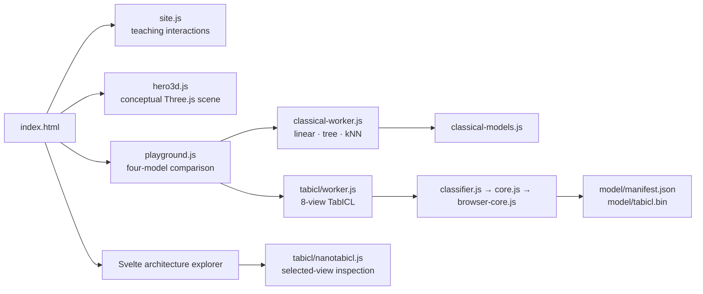

# An Interactive Guide to Tabular Foundation Models

Interactive teaching materials created for the
[NeurIPS 2026 Education Track](https://neurips.cc/Conferences/2026/CallforEducationalResources).
The tutorial explains how tabular foundation models use labeled rows as inference
context, with TabICLv2 as the reproducible worked example.

- **Deployed site:** https://affirm.github.io/tabular-foundation-models-tutorial/
- **Repository:** https://github.com/Affirm/tabular-foundation-models-tutorial

## Teaching sequence

1. **Problem:** how mixed types, missingness, imbalance, and limited rows complicate prediction.
2. **Adaptation:** fitting task-specific parameters compared with providing labeled context.
3. **Theory:** an interactive PFN task-prior overview and its expected query-loss objective.
4. **Architecture:** try four predictors side by side, then follow training and frozen inference.
5. **Live model explorer:** a browser checkpoint with measured intermediate values.
6. **References:** models, papers, code, weights, datasets, and benchmarks.

## Interactive visuals

The site labels explanatory simulations separately from measured model execution.

| Visual | Implementation | What it represents |
| --- | --- | --- |
| Hero computation graph | Three.js in `hero3d.js` | Conceptual table-to-prediction flow. It performs no model computation. |
| Table stress test | DOM and JavaScript in `site.js` | Real UCI Online Shoppers records with scripted perturbations. |
| Boosted-tree comparison | Canvas and DOM in `site.js` | High-level task-specific fitting, not a full XGBoost implementation. |
| PFN theory module | DOM, MathML, and JavaScript in `site.js` | Sampled tasks, context/query splits, predictions, numeric loss, and the expected training objective. |
| Training flow | Canvas in `site.js` | A step-selectable simulation using nanoTabICL dimensions. It does not train the browser model. |
| Inference flow | Canvas in `site.js` | A shape-accurate explanation of the nanoTabICL forward graph. |
| Browser playground | Four canvases plus two Web Workers | Synchronized logistic, tree, kNN, and TabICLv2 probability fields over one dataset and query. Classical models run in one worker; the mixed int8/fp16 TabICLv2 port runs in another. |
| Embedded architecture explorer | SvelteKit | Local selected-view execution with attention and tensor inspection inside the tutorial. |

## Browser runtime



The page preloads the 28 MB checkpoint and initializes it in the TabICL worker before the playground is used.
Inference runs locally. No table rows are sent to a remote model service. The embedded
explorer initializes its own model instance when its iframe loads.

## JavaScript map

| File | Responsibility |
| --- | --- |
| `materials/website/js/site.js` | Scroll reveals, outline navigation, table and boosting demos, PFN episode, architecture flows, and responsive canvas drawing. |
| `materials/website/js/hero3d.js` | Three.js hero scene, drag rotation, frame limiting, and viewport-based pause behavior. |
| `materials/website/js/playground.js` | Shared datasets, synchronized 2×2 canvases, query interaction, and orchestration across both workers. |
| `materials/website/js/playground3d.js` | Pure perspective projection, probability-color, slice-interpolation, and attention-ranking helpers for the playground. |
| `materials/website/js/classical-models.js` | Logistic regression and depth-limited CART fit/predict implementations. |
| `materials/website/js/classical-worker.js` | Fits and evaluates logistic, tree, and kNN fields off the main thread. |
| `materials/website/js/tabicl/worker.js` | Fetches upstream checkpoint assets and executes the browser port away from the main UI thread. |
| `materials/website/js/tabicl/nanotabicl.js` | Legacy selected-view bridge used only by the Svelte explorer. |
| `materials/tabicl-explainer/src/lib/tabicl.ts` | Connects the Svelte explorer to the shared runtime and model assets. |

## Folder layout

```text
tabular-foundation-models-tutorial/
├── .github/workflows/
│   ├── notebook.yml
│   └── pages.yml
├── LICENSE
├── LICENSE-CONTENT
├── NOTICE
├── THIRD_PARTY_NOTICES
├── README.md
├── materials/
│   ├── README.md                   # archive setup instructions
│   ├── LICENSE                     # Apache 2.0 for original code
│   ├── LICENSE-CONTENT             # CC BY 4.0 for original teaching content
│   ├── NOTICE
│   ├── THIRD_PARTY_NOTICES
│   ├── requirements.txt
│   ├── requirements-lock.txt       # hashed Python 3.11 transitive lock
│   ├── notebooks/                  # self-guided TabICLv2 primer
│   ├── website/
│   │   ├── index.html
│   │   ├── css/main.css
│   │   ├── js/
│   │   ├── model/
│   │   └── tabicl-explainer/       # generated by the Svelte build
│   └── tabicl-explainer/           # Svelte source
└── tests/                           # promoted runtime and visualization tests
```

Virtual environments, dependency folders, local caches, and generated Svelte output are ignored
by Git.

## Run locally

Requirements:

- Node.js 20 or newer
- npm 10 or newer
- Python 3 for the static HTTP server

From this project folder:

```bash
# Build the standalone Svelte explorer into materials/website/tabicl-explainer
cd materials/tabicl-explainer
npm ci
npm run build

# Serve the complete website
cd ../website
./serve.sh 8000
```

Open http://localhost:8000/. Do not open `index.html` with `file://`; ES module
workers and sibling model assets require HTTP.

To work only on the Svelte explorer:

```bash
cd materials/tabicl-explainer
npm run dev
```

The Vite plugin serves the sibling checkpoint at `/model/` during development.

## Verification

```bash
# Check the plain JavaScript entry points and workers
for file in materials/website/js/{site,hero3d,knn,playground,playground3d,classical-models,classical-worker}.js \
  materials/website/js/tabicl/{worker,classifier,core,browser-core}.js; do
  node --check "$file"
done

# Check all browser-model and visualization tests
node --test tests/*.test.mjs

# Confirm the standalone explorer builds
cd materials/tabicl-explainer
npm run build
cd ../..
```

## Deployment

`.github/workflows/pages.yml` deploys the site when website or
Svelte source files reach `main`.

1. CI installs the Svelte dependencies.
2. SvelteKit writes relative assets to `materials/website/tabicl-explainer/`.
3. GitHub uploads `materials/website/` as the Pages root.
4. The browser resolves the shared model from `materials/website/model/`.

The generated Svelte output is intentionally ignored because CI rebuilds it. GitHub
Pages may briefly serve a cached `css/main.css` after deployment. A cache-bypass reload
loads the current stylesheet.

## Model and visual provenance

- Browser checkpoint details: [`materials/website/model/PROVENANCE.md`](materials/website/model/PROVENANCE.md)
- Transformer Explainer adaptation and citation: [`materials/tabicl-explainer/README.md`](materials/tabicl-explainer/README.md)
- Adapted interface license: [`materials/tabicl-explainer/LICENSE`](materials/tabicl-explainer/LICENSE)

TabICL, nanoTabICL, Three.js, datasets, and model checkpoints retain their upstream
terms. The reference collection in the website links each model to its primary source.

## License

Unless otherwise noted, original software and code are licensed under the
[Apache License, Version 2.0](LICENSE), and original educational content is licensed under
[Creative Commons Attribution 4.0 International](LICENSE-CONTENT). Copyright (c) 2026,
Affirm, Inc. All rights reserved. See [NOTICE](NOTICE) for the project notice and
[THIRD_PARTY_NOTICES](THIRD_PARTY_NOTICES) for the separate terms and attributions that apply
to third-party software, model artifacts, adapted materials, and data.

## Related work

- [TabArena](https://arxiv.org/abs/2506.16791), TabPFN, TabICL, and related benchmarks are cited in the website.
