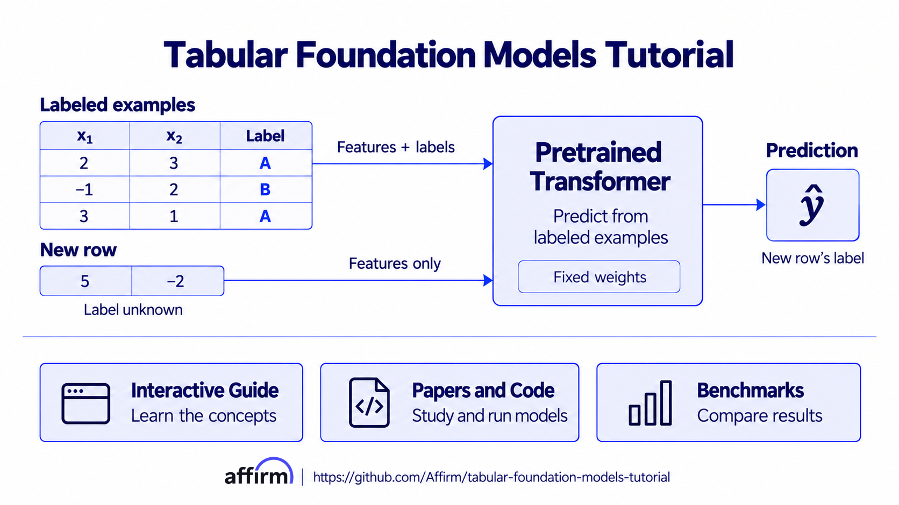

# Tabular Foundation Models Tutorial

[Interactive website](https://affirm.github.io/tabular-foundation-models-tutorial/) · [Python notebook](https://colab.research.google.com/github/Affirm/tabular-foundation-models-tutorial/blob/main/materials/notebooks/01_tabicl_primer.ipynb) · [Our guide](#our-interactive-guide) · [Model landscape](#model-landscape) · [Learning resources](#tutorials-and-learning-resources) · [Conference resources](#conference-and-workshop-resources)

Table as Prompt: An Interactive Guide to Tabular Foundation Models - accepted for presentation at the [NeurIPS 2026 Education Track](https://neurips.cc/Conferences/2026/CallforEducationalResources).



## What are tabular foundation models?

Tabular foundation models (TFMs) are pretrained predictors designed for reuse across tabular datasets. Conventional workflows fit and often tune a separate model for each dataset. PFN-style TFMs pretrain a shared predictor across sampled tasks. At inference, labeled rows provide context for predicting unlabeled query rows, without task-specific gradient updates. This adaptation through examples is **tabular in-context learning**.

[Prior-data fitted networks (PFNs)](https://arxiv.org/abs/2112.10510) learn from tasks sampled from a prior. During pretraining, the model predicts held-out query labels from context rows. The task distribution and expected query loss shape its learned inductive bias. [TabPFN](https://arxiv.org/abs/2207.01848) demonstrated this approach for small tabular classification tasks. Our guide uses [TabICLv2](https://arxiv.org/abs/2602.11139) as a worked example; its architecture and inference procedure are model-specific, not shared by every TFM.

The broader goal is reusable prediction for structured data. The field now covers classification and regression across different table sizes, with open questions about robustness, scale, efficiency, and evaluation. Strong task-specific methods, including boosted trees, remain baselines for assessing where these models help.

## Our interactive guide

Open the [guide](https://affirm.github.io/tabular-foundation-models-tutorial/) in a modern browser. Follow the sequence from tabular prediction and adaptation through PFN theory, TabICLv2 training, and inference. Then try the browser playground and inspect the model's intermediate computations. Basic supervised learning is enough to get started.

TabICLv2 is the worked example. The guide distinguishes explanatory simulations from real model execution; browser inference runs locally. For a Python exercise, use the [notebook](materials/notebooks/01_tabicl_primer.ipynb) or [open it in Colab](https://colab.research.google.com/github/Affirm/tabular-foundation-models-tutorial/blob/main/materials/notebooks/01_tabicl_primer.ipynb). [Setup instructions](materials/README.md) cover the notebook environment.

## Model landscape

TFMs differ in what they learn from and how they adapt. Synthetic-prior models learn across generated tasks; real-data models learn across existing tables. Other work brings text semantics into prediction or extends the size of the inference context.

Selected milestones through October 4, 2026. Each date links to a primary source and identifies the event: a release, an announcement, or a paper. Preprint dates are the first arXiv submission dates; they do not establish when code or weights became available. Team labels identify a lead institution or the project maintainer; papers list the full author affiliations.

| Date | Model / team | Research direction | Dated source | Code / weights |
| --- | --- | --- | --- | --- |
| 2022-07-05 | [TabPFN](https://github.com/PriorLabs/TabPFN) · [ AutoML · Freiburg](https://www.automl.org/) | Synthetic-prior pretraining for in-context classification on small tables. | [Preprint](https://arxiv.org/abs/2207.01848) | [GitHub](https://github.com/PriorLabs/TabPFN) |
| 2024-10-23 | [TabDPT](https://github.com/layer6ai-labs/TabDPT-inference) · [ Layer 6](https://github.com/layer6ai-labs) | Self-supervised pretraining on real tables, with retrieval for context selection. | [Preprint](https://arxiv.org/abs/2410.18164) | [GitHub](https://github.com/layer6ai-labs/TabDPT-inference) · [Hugging Face](https://huggingface.co/Layer6/TabDPT) |
| 2025-01-08 | [TabPFNv2](https://github.com/PriorLabs/TabPFN) · [ Prior Labs](https://priorlabs.ai/) | Extends tabular prediction to regression and larger datasets. | [Nature paper](https://www.nature.com/articles/s41586-024-08328-6) | [GitHub](https://github.com/PriorLabs/TabPFN) · [Hugging Face](https://huggingface.co/Prior-Labs) |
| 2025-02-08 | [TabICL](https://github.com/soda-inria/tabicl) · [ Inria](https://github.com/soda-inria) | Builds row embeddings before in-context learning to handle larger tables. | [Preprint](https://arxiv.org/abs/2502.05564) | [GitHub](https://github.com/soda-inria/tabicl) · [Hugging Face](https://huggingface.co/jingang/TabICL) |
| 2025-05-23 | [TabSTAR](https://github.com/alanarazi7/TabSTAR) · [Technion](https://eilamshapira.com/TabSTAR/) | Transfer learning with target-aware text representations. | [Preprint](https://arxiv.org/abs/2505.18125) | [GitHub](https://github.com/alanarazi7/TabSTAR) · [Hugging Face](https://huggingface.co/alana89/TabSTAR) |
| 2025-06-12 | [ConTextTab](https://github.com/SAP-samples/sap-rpt-1-oss) · [ SAP](https://github.com/SAP) | Combines semantic embeddings with tabular ICL and real-data pretraining. | [Preprint](https://arxiv.org/abs/2506.10707) | [GitHub](https://github.com/SAP-samples/sap-rpt-1-oss) · [Hugging Face](https://huggingface.co/SAP/sap-rpt-1-oss) |
| 2025-07-22 | [Mitra](https://huggingface.co/autogluon/mitra-classifier) · [ AWS · AutoGluon](https://github.com/autogluon) | Uses a mixture of synthetic priors for classification and regression. | [Release announcement](https://www.amazon.science/blog/mitra-mixed-synthetic-priors-for-enhancing-tabular-foundation-models) | [GitHub](https://github.com/autogluon/autogluon) · [Hugging Face](https://huggingface.co/autogluon) |
| 2025-09-03 | [LimiX](https://github.com/limix-ldm-ai/LimiX) · [ Stable AI](https://github.com/limix-ldm-ai) | Models joint distributions over table variables and missingness. | [Preprint](https://arxiv.org/abs/2509.03505) | [GitHub](https://github.com/limix-ldm-ai/LimiX) · [Hugging Face](https://huggingface.co/stable-ai/LimiX-1_16M) |
| 2025-11-11 | [TabPFN-2.5](https://github.com/PriorLabs/TabPFN) · [ Prior Labs](https://priorlabs.ai/) | Expands table size and adds distillation into smaller predictors. | [Preprint](https://arxiv.org/abs/2511.08667) | [GitHub](https://github.com/PriorLabs/TabPFN) · [Hugging Face](https://huggingface.co/Prior-Labs/tabpfn_2_5) |
| 2026-02-11 | [TabICLv2](https://github.com/soda-inria/tabicl) · [ Inria](https://github.com/soda-inria) | Adds regression and revises synthetic priors, attention, and pretraining. | [Preprint](https://arxiv.org/abs/2602.11139) | [GitHub](https://github.com/soda-inria/tabicl) · [Hugging Face](https://huggingface.co/jingang/TabICL) |
| 2026-05-13 | [TabPFN-3](https://docs.priorlabs.ai/changelog/tabpfn-3) · [ Prior Labs](https://priorlabs.ai/) | Scales in-context prediction to million-row datasets. | [Preprint](https://arxiv.org/abs/2605.13986) | [GitHub](https://github.com/PriorLabs/TabPFN) · [Hugging Face](https://huggingface.co/Prior-Labs/tabpfn_3) |
| 2026-06-12 | [Nori](https://github.com/Synthefy/synthefy-nori) · [ Synthefy](https://www.synthefy.com/) | Synthetic-data pretraining for in-context regression with quantile predictions. | [Release announcement](https://www.synthefy.com/blog/synthefy-tabular-release) | [GitHub](https://github.com/Synthefy/synthefy-nori) · [Hugging Face](https://huggingface.co/Synthefy/Nori) |
| 2026-06-30 | [TabFM](https://research.google/blog/introducing-tabfm-a-zero-shot-foundation-model-for-tabular-data/) · [ Google Research](https://research.google/) | Google's synthetic-data model for in-context classification and regression. | [Announcement](https://research.google/blog/introducing-tabfm-a-zero-shot-foundation-model-for-tabular-data/) | [Project](https://research.google/blog/introducing-tabfm-a-zero-shot-foundation-model-for-tabular-data/) |
| 2026-09-15 | [TabPFN-3.5](https://github.com/PriorLabs/TabPFN) · [ Prior Labs](https://priorlabs.ai/) | Extends evaluation and capabilities to temporal, grouped, and mixed-modality tables. | [Release announcement](https://priorlabs.ai/technical-reports/tabpfn-3-5) | [GitHub](https://github.com/PriorLabs/TabPFN) · [Hugging Face](https://huggingface.co/Prior-Labs/tabpfn_3_5) |
| 2026-09-29 | [Kumo Tabular](https://github.com/NVIDIA/structured-data-models) · [ NVIDIA](https://github.com/NVIDIA) | Synthetic-data pretraining with column, row, and in-context attention for classification and regression. | [Release announcement](https://huggingface.co/blog/nvidia/kumo-tabular) | [GitHub](https://github.com/NVIDIA/structured-data-models) · [Hugging Face](https://huggingface.co/nvidia/Kumo-Tabular) |


## Conference and workshop resources

| Collection | What to explore |
| --- | --- |
| [NeurIPS 2026 resources](resources/neurips.md) | Our Education Track guide, selected 2026 model and benchmark papers, and code. |
| [FMSD 2026 workshop](https://openreview.net/group?id=ICML.cc/2026/Workshop/FMSD#tab-your-consoles) | OpenReview page for the ICML workshop on Foundation Models for Structured Data. |

## Tutorials and learning resources

| Resource | What to learn |
| --- | --- |
| [Tabular Foundation Models, Christoph Molnar](https://tabularfoundationmodels.com/) | An online book covering PFNs, in-context learning, pretraining, and practical prediction examples. |
| [TabPFN documentation](https://docs.priorlabs.ai/) | Official quickstarts and examples for applying TabPFN to classification and regression. |
| [TabICL documentation](https://tabicl.readthedocs.io/en/latest/) | Official usage instructions, configuration, and API reference. |
| [nanoTabPFN](https://github.com/automl/nanoTabPFN) | A small educational implementation for studying the model and training loop. |
| [nanoTabICL](https://github.com/soda-inria/nanotabicl) | A compact implementation of the TabICLv2 architecture and a simplified synthetic-data prior. |
| [Transformer Explainer](https://poloclub.github.io/transformer-explainer/) | An interactive introduction to attention and transformer computation, using a language model. |

For a conceptual introduction, start with Molnar's book. To run a model on your own table, use the official documentation. To study how it is built, read the nano implementations alongside the papers below.

## Papers and model implementations

These are selected entry points into PFN-based tabular prediction. Follow each project's documentation for available checkpoints, supported tasks, and terms of use.

| Topic | Paper | Code and documentation |
| --- | --- | --- |
| PFN foundations | [Transformers Can Do Bayesian Inference](https://arxiv.org/abs/2112.10510) | [PFNs](https://github.com/SamuelGabriel/PFNs) |
| TabPFN | [TabPFN-3 technical report](https://arxiv.org/abs/2605.13986) | [Official code](https://github.com/PriorLabs/TabPFN) · [Documentation and model access](https://docs.priorlabs.ai/) |
| TabICL | [TabICLv2 paper](https://arxiv.org/abs/2602.11139) | [Official code and checkpoints](https://github.com/soda-inria/tabicl) · [Documentation](https://tabicl.readthedocs.io/en/latest/) |

## Benchmarks and evaluation

Choose a benchmark for the capability you need to evaluate: predictive accuracy, generalization across data regimes, probabilistic predictions, or multimodal inputs.

| Resource | What it offers | Sources |
| --- | --- | --- |
| TabArena | A maintained benchmark for comparing tabular models under documented evaluation settings. | [Paper](https://arxiv.org/abs/2506.16791) · [Code](https://github.com/autogluon/tabarena) · [Datasets](https://github.com/tabarena/data-foundry) · [Leaderboard](https://tabarena.ai/) |
| BeyondArena | Generalization across IID, temporal, and grouped tasks, table sizes, and feature types. | [Paper](https://arxiv.org/abs/2606.30410) · [Code](https://github.com/autogluon/tabarena) · [Data Foundry](https://github.com/tabarena/data-foundry) |
| ScoringBench | Probabilistic regression evaluated with proper scoring rules, including CRPS and interval scores, alongside point-prediction metrics. | [Paper](https://arxiv.org/abs/2603.29928) · [Code and data setup](https://github.com/jonaslandsgesell/ScoringBench) · [Leaderboard](https://scoringbench.com/) |
| MulTaBench | Multimodal tabular learning with text and image inputs. | [Paper](https://arxiv.org/abs/2605.10616) · [Code and datasets](https://github.com/alanarazi7/MulTaBench) |
| TALENT | A toolkit for comparing classical and deep tabular methods, with datasets and preprocessing options. | [Paper](https://www.jmlr.org/papers/v26/25-0512.html) · [Code and datasets](https://github.com/LAMDA-Tabular/TALENT) |
| TabZilla | An empirical study of when neural networks and boosted trees perform well on tabular data. | [Paper](https://arxiv.org/abs/2305.02997) · [Code and datasets](https://github.com/naszilla/tabzilla) |

Read results with their dataset splits, tuning budgets, and ensembling settings. Scores from separate papers do not form a single ranking. Use these resources to choose an evaluation protocol and baselines for your own task.

## Run this guide locally

Requires Node.js 20+, npm 10+, and Python 3. From the repository root:

```bash
cd materials/tabicl-explainer
npm ci
npm run build
cd ../website
./serve.sh 8000
```

Open [localhost:8000](http://localhost:8000/). Serve over HTTP so that module workers and model assets load correctly.

## Attribution and license

[Browser model provenance](materials/website/model/PROVENANCE.md) documents the checkpoint and export. The [explorer README](materials/tabicl-explainer/README.md) credits the adaptation of Transformer Explainer.

Unless otherwise noted, original software and code are licensed under the [Apache License, Version 2.0](LICENSE), and original educational content is licensed under [Creative Commons Attribution 4.0 International](LICENSE-CONTENT). Copyright (c) 2026, Affirm, Inc. All rights reserved. See [NOTICE](NOTICE) for the project notice and [THIRD_PARTY_NOTICES](THIRD_PARTY_NOTICES) for the separate terms and attributions that apply to third-party software, model artifacts, adapted materials, and data.
